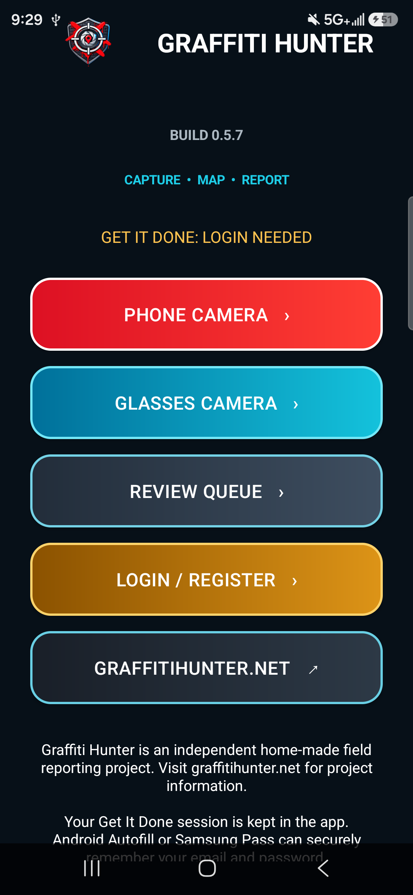
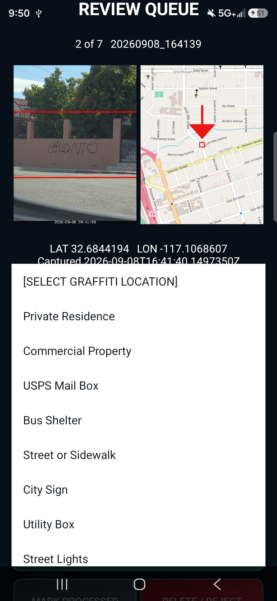
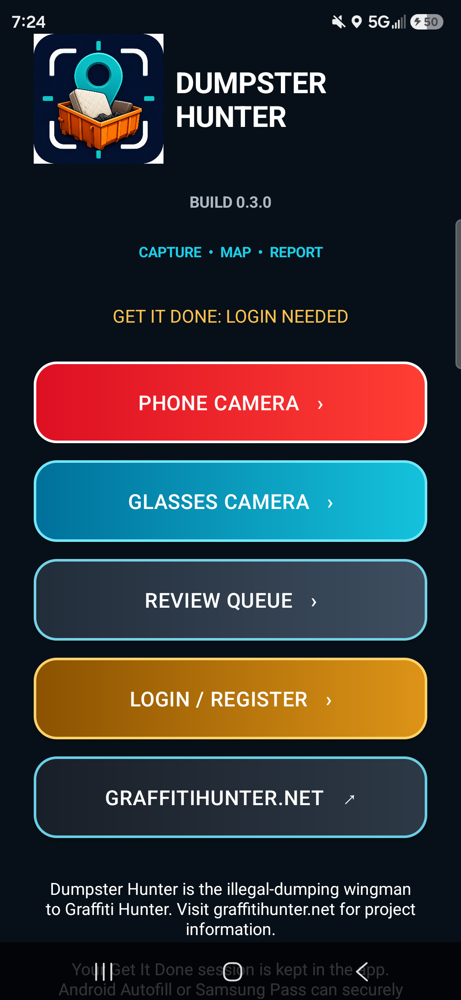

<p align="center">
  
</p>

<h1 align="center">Graffiti Hunter</h1>

<p align="center"><strong>Capture. Map. Review. Help.</strong></p>

<p align="center">
  An independent San Diego civic-technology field project that helps residents
  document graffiti and illegal dumping accurately, organize the evidence, and
  prepare reports for human review.
</p>

<p align="center">
  <a href="https://graffitihunter.net/">Project website</a> ·
  <a href="https://github.com/ottobohn187/Graffiti-Hunter/releases/tag/graffiti-v0.5.7">Graffiti Hunter APK</a> ·
  <a href="https://github.com/ottobohn187/Graffiti-Hunter/releases/tag/dumpster-v0.3.0">Dumpster Hunter APK</a>
</p>

## Mission

Use practical technology to help communities report neighborhood problems with
clearer evidence and more accurate locations. The apps are designed for fast
field collection followed by deliberate review. They do not silently submit a
report: the user verifies the package and controls the final action on the
official reporting website.

This repository contains the canonical, 100% native Android implementations.
Neither application contains or launches the Unity runtime.

## Field workflow

1. **Capture** — take a high-resolution image with the Android phone camera or
   a compatible connected-eyewear camera stream.
2. **Locate** — record the phone's current GPS coordinates and generate a
   marked OpenStreetMap location image.
3. **Package** — keep the original photo, map, latitude/longitude, timestamp,
   GPS accuracy, category, and suggested description together on the device.
4. **Review** — inspect the full-size photo and map, correct the category,
   update the package, mark it processed, or delete it.
5. **Prepare** — open San Diego Get It Done in an in-app browser session and
   prefill the available location, description, category, and attachment
   fields. The user reviews and performs the final submission.

## Screenshots

<table>
  <tr>
    <td align="center"><strong>Graffiti Hunter 0.5.7</strong></td>
    <td align="center"><strong>Mapped review package</strong></td>
    <td align="center"><strong>Dumpster Hunter 0.3.0</strong></td>
  </tr>
  <tr>
    <td></td>
    <td></td>
    <td></td>
  </tr>
</table>

The middle screenshot shows a real field package: the evidence image, marked
map location, coordinates, capture time, and report-category choices remain
together for later review.

## Applications

| Application | Version | Purpose | Source |
| --- | ---: | --- | --- |
| Graffiti Hunter | 0.5.7 | Graffiti evidence and reporting packages | [`GraffitiHunter/NativeAndroid`](GraffitiHunter/NativeAndroid) |
| Dumpster Hunter | 0.3.0 | Illegal-dumping and bulky-item packages | [`DumpsterHunter/NativeAndroid`](DumpsterHunter/NativeAndroid) |

Both applications support:

- native Android Camera2 capture, autofocus, rotation, and lens zoom;
- compatible glasses-camera streaming and Bluetooth clicker input;
- current phone GPS with accuracy metadata;
- photo and independently generated marked-map evidence;
- local, user-controlled queues with edit and deletion controls;
- persistent Get It Done web sessions using Android WebView cookies and secure
  device autofill/password-manager support; and
- portrait and landscape capture/review flows.

## Privacy and control

- Approved packages are stored locally in the app's Android storage area and
  approved photo/map images are copied to the device gallery.
- Account passwords are not stored in this source code or in custom plaintext
  files. Login persistence relies on the website session and Android's secure
  autofill or password manager.
- Nothing is automatically submitted to the City.
- Users can review, revise, mark processed, or permanently delete packages.
- GPS and category information should always be checked before submission.

## Build from source

Each app has its own Gradle wrapper. On Windows, with an Android SDK configured:

```powershell
cd GraffitiHunter/NativeAndroid
./gradlew.bat app:assembleRelease app:lintRelease
```

For Dumpster Hunter, use `DumpsterHunter/NativeAndroid` instead. Generated APKs
are written beneath `app/build/outputs/apk/release/` and are intentionally not
committed. Tested APKs are published through GitHub Releases.

## Project status

These are beta field tools under active testing on modern Samsung Android
hardware. The current standalone builds are Graffiti Hunter 0.5.7 and Dumpster
Hunter 0.3.0. This independent project is not affiliated with, endorsed by, or
operated by the City of San Diego.
